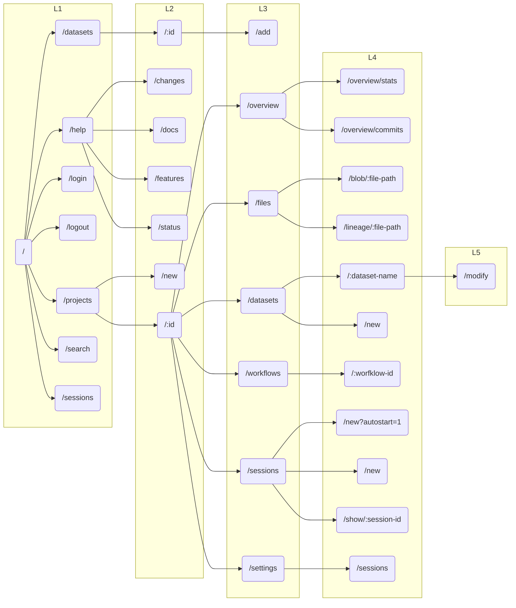
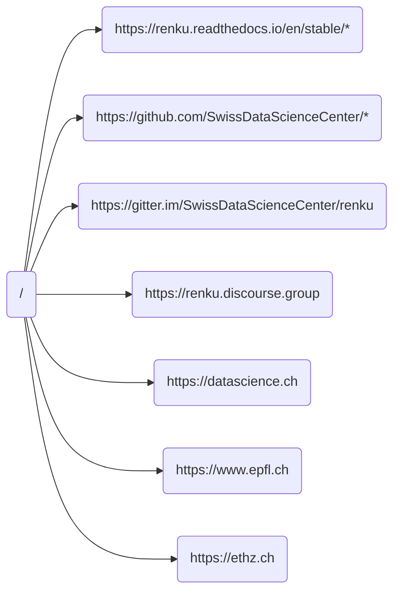

[](https://github.com/SwissDataScienceCenter/renku-ui/actions?query=branch%3Amaster+workflow%3A%22Test+and+CI%22)
[](https://conventionalcommits.org)
[](https://github.com/SwissDataScienceCenter/renku-ui/releases)

# Renku UI

The web-based UI for [Renku](https://github.com/SwissDataScienceCenter/renku).

This README contains information relevant to contributors to the renku-ui component. To deploy RenkuLab, including the UI, see the [Administrator's Guide](https://renku.readthedocs.io/en/latest/how-to-guides/admin/deploying-renku.html).

# Architecture

The Renku UI is made up of two subcomponents, which are each packaged as [Docker](https://www.docker.com) containers and are deployed using [Kubernetes](https://kubernetes.io).

|        |                                                 |
| ------ | ----------------------------------------------- |
| client | [React-based](https://reactjs.org) front-end    |
| server | [Express-based](https://expressjs.com) back-end |

Below, we explain each of those components in greater detail and guidelines for developing code within them.

# Prerequisites

To develop on this codebase, you will want the following tools installed.

|                                      |                                                     |
| ------------------------------------ | --------------------------------------------------- |
| [node](https://nodejs.org/en/)       | Node JavaScript execution environment               |
| [npm](https://github.com/npm/cli)    | Node package manager                                |
| [nvm](https://github.com/nvm-sh/nvm) | NVM or some similar tool for managing node versions |

Node is a requirement; when you install node, you will probably also get npm automatically. Though not absolutely necessary, we recommend using a **node version manager** like nvm to manage node/npm installations.

However you get it, you need the node version specified in the [Dockerfile](https://github.com/SwissDataScienceCenter/renku-ui/blob/master/client/Dockerfile).

## Git hooks

This project uses [husky](https://typicode.github.io/husky) to handle git hooks.

    $ npm install

This will install husky and the git hooks.

## Recommended tools

If you are content with testing your changes using Cypress, all you need is node. If you want to develop and test your changes against a real RenkuLab deployment, then you will need a few more tools.

|                                                                      |                                                                     |
| -------------------------------------------------------------------- | ------------------------------------------------------------------- |
| [kubectl](https://kubernetes.io/docs/tasks/tools/)                   | K8s command-line tool                                               |
| [telepresence](https://www.telepresence.io/docs/latest/quick-start/) | Tool for redirecting requests to your local development environment |

Kubectl and telepresence will allow you to inject code running on your development machine into a K8s deployment. These two tools will be sufficient if you do not need to deploy the renku application into K8s yourself. If you **do** need to do that, then you will additionally need:

|                                  |                              |
| -------------------------------- | ---------------------------- |
| [docker](https://www.docker.com) | For building containers      |
| [helm](https://helm.sh)          | For packaging things for K8s |

# Client

The client is the [React-based](https://reactjs.org) front-end for RenkuLab. Development started in 2017, and, in the intervening years, we have striven to change our development style to reflect the evolving best practices around the tools we use. You will see that not all code conforms to the guidelines laid out in this document, but **new code** should follow these guidelines, and older code should be refactored at opportune moments, whenever possible, to conform as well.

Further technical details are available in [README file in the `client` folder](./client/README.md).

## Tool Stack

| Framework                                     | Purpose                                       |
| --------------------------------------------- | --------------------------------------------- |
| [Bootstrap](https://getbootstrap.com)         | Responsive grid, HTML styling, and components |
| [Cypress](https://www.cypress.io)             | UI testing framework                          |
| [React](https://reactjs.org)                  | Reactive component framework                  |
| [Reactstrap](https://reactstrap.github.io/)   | React bindings for Bootstrap                  |
| [Redux Toolkit](https://redux-toolkit.js.org) | State and React-integration components        |
| [Storybook](https://storybook.js.org)         | UI component documentation                    |
| [TypeScript](https://www.typescriptlang.org)  | JavaScript extension with static typing       |

## Code Formating

We use [prettier](https://prettier.io/docs/en/) to format the client codebase.

You can manually run formatting with the following:

    $ cd client
    $ npm run format

This repository is configured to automatically format the client files on
commit.

To automatically format on save in VS Code, you can install the
`esbenp.prettier-vscode` extension then open your workspace settings.
First, search for `editor.defaultFormatter` and set it to `Prettier`, then
search for `editor.formatOnSave` and turn on "Format on save".

## Unit Tests and Linting

We use [jest](https://jestjs.io) for unit tests and
[eslint](https://eslint.org/) for linting. We run them in out CI piplines and
require both to pass without warnings before we merge a PR. You can manually run
tests using the following commands:

    $ cd client   # or server if you need to work there
    $ npm test
    $ npm run lint

Mind that some linting errors can be automatically fixed by running `npm run lint-fix`.

We suggest using an IDE that supports eslint (like [VS Code](https://code.visualstudio.com) or similar) and configuring your IDE to integrate with our eslint configuration so that any linting errors will be displayed as you develop rather than waiting for the CI pipeline to flag them.

### Utilities

We are using [Craco](https://craco.js.org) to override default settings from
[Create React App](https://create-react-app.dev).
This means that Jest cannot be run outside of Craco's context.

If you ever need to debug your tests using advanced features like `node --expose-gc`
or `node --inspect-brk`, you have to reference jest from
`./node_modules/@craco/craco/dist/bin/jest`.

The following example shows how to check for memory leaks:

    $ node --expose-gc ./node_modules/@craco/craco/dist/bin/jest --runInBand --logHeapUsage *

## Developing

As you would expect for a React-based project, you can install the client using `npm`.

    $ cd client
    $ npm install

This will install the toolchain for developing the client as well as any libraries used in the UI.

To run and interact with the UI code on your development machine, you can either use the Cypress tests, which provide mocked responses from the backend, or use telepresence to replace the UI client component in a K8s-based deployment with the component running on your machine.

### Cypress

We have an ever-growing suite of UI tests developed with Cypress. The tests can be run with mock responses from the backend, and can therefore be used to try out changes to the UI without access to a development cluster.

    $ cd tests
    $ npm install
    $ npm run e2e:local

### Storybook

We use [Storybook](https://storybook.js.org) to create interactive stories for our UI components.
Stories provide a visual representation of how our components behave in different scenarios.

#### Run Storybook

Run the following command to start Storybook:

    $ npm run storybook

This should automatically open your browser at http://localhost:6006 where you can see your components in action.

#### Write stories

To create new story files for your components, just add a new `<ComponentName>.stories.tsx` file.
As an example of a well-structured and documented story, you can check out the Button component
in `client/src/components/buttons/Buttons.stories.tsx`.

The full documentation for Storybook can be found [here](https://storybook.js.org/docs/react/writing-stories/introduction).

#### Best Practices

- Add stories files in the same directory as your component.
- Name your story after the target component `<ComponentName>.stories.tsx`. Use the `title` property in the story definition to group related stories by categories. E.G.. `components/buttons/buttonWithMenu`.
- It's good to showcase different variations of your component. Use multiple stories to demonstrate how props and states affect the component and how that helps in serving different use cases.
- Provide a clear and concise description for each story. Include details on its purpose, usage, and any relevant notes.
- Use `Args` to tweak props' values, making the components interactive so that users can play with them.
- Wherever relevant, please include stories that demonstrate responsive behavior across various devices.
- You can use `addon-redux` for state management on components that require to get data from the Redis store.

#### Testing Stories:

Storybook's test runner transforms stories into executable tests, supporting Chromium and Firefox browsers. It ensures error-free rendering for non-play stories. For interactive stories with play functions, it validates both play function errors and successful assertions.

    $ npm run storybook-compile-and-test


#### Deployment

Storybook is deployed at the following location:

- **URL**: `/storybook/`

To access Storybook, visit the specified URL path in your web browser after your application is deployed.

### Telepresence

Telepresence can be used to develop the UI in a realistic setting. The client folder includes a `run-telepresence.sh` script that is tailored for the SDSC development cluster.

    $ cd client
    $ ./run-telepresence.sh

Telepresence replaces the UI client pod in the target Kubernetes instance. All the traffic is then redirected to a local process, making changes to files almost immediately available in your development RenkuLab instance.

The `run-telepresence.sh` script uses the current K8s context as returned by `kubectl config current-context`. You can deploy your own RenkuLab application (using the helm chart in the renku repository) for development; alternatively the renku-ui repository includes CI tasks that can deploy the code for a PR. To take advantage of this task, add

    $ /deploy #persist

To the body of your PR description.

There are a few environment variables you may want to set when starting telepresence if you are going to to take advantage of the Renku team internal development infrastructure:

- SENTRY: set to 1 to redirect the exceptions to the dev [sentry](https://sentry.dev.renku.ch) deployment
- PR: set to the target PR number in the [renku-ui](https://github.com/SwissDataScienceCenter/renku-ui/pulls) repo to work in the corresponding CI deployment
- DEV_NAMESPACE: if you do not target a PR deployment you should specify a value for this to reference the namespace with your development deployment

For example:

    $ SENTRY=0 PR=1166 ./run-telepresence.sh

There are also further configuration possibilities offered by the `run-telepresence.sh` script. For
specific use cases, you may need to modify the script directly, since not all options are configurable through environment variables.

## Coding Guidelines

The coding guidelines are detailed in full in [CODING_GUIDELINES.md](CODING_GUIDELINES.md).

As explained above, not all the code in the repo conforms to these guidelines, but this section explains how code _should_ be developed in the repo.

### **Use Typescript**

New code should be developed in TypeScript, and older code should be converted to TypeScript whenever feasible.

### **React components should be functional and take advantage of hooks**

- Use `useState` to manage component-local state
- Use `useEffect` for handling the component lifecycle

### **Application state is managed by Redux**

We follow the [redux-toolkit](https://redux-toolkit.js.org/tutorials/typescript) style for interacting with Redux. If you are not familiar with this, follow the link to see the tutorial.

Key points around this include:

- Global application state is kept in a single, global [Redux](https://redux.js.org) store
- Features (see below) should make [slices](https://redux-toolkit.js.org/usage/usage-with-typescript#createslice) that encapsulate the state they need and add the slices into the [global store](https://redux-toolkit.js.org/api/configureStore).
- Use the `useSelector` hook to access information from slices in components
- Use the `useDispatch` hook to make changes to state in components

### **Interact with backend services using RTK Query**

[RTK Query](https://redux-toolkit.js.org/tutorials/rtk-query) greatly simplifies interacting with other services. It automatically provides integration with the Redux store and handles caching of responses and transitions through the request lifecycle (e.g., _fetching_, etc.).

### **Group shared code into features**

Based on [these suggestions from Redux](https://redux.js.org/faq/code-structure), we decided to use a few folders to bundle functions and components together, broadly following the "Feature folders" style.

Here are the folders in `/client/src` where to place new components:

- `features`: create/use sub-folders to contain files identifying single features. These sometimes correspond to Renku abstractions, like "Projects", "Datasets", "Sessions", or to cross-entity features such as "Search" and "Dashboard". All RTK queries should be triggered by components in this folder. Most of the actions to save data in the Redux store slices should be defined here as well.
- `components`: add here components that can be reused in different contexts. If something is clearly a shared component (E.G. `RenkuAlert`), put it here. If it's not obvious, and currently used by just one component, you can leave it in the `feature` folder (follow the principle: do not over-engineer it too early). Mind that we also store most of the temporary values in the Redux store, so you can define actions here if necessary.
- `utils`: put here anything generic that doesn't fall into the previous categories (E.G. constants, helper functions, wrappers).

Picking the perfect place isn't always straightforward and our current folder structure still has many outdated components that don't follow the convention. We plan to move them when already touching the code for other changes.

### **Use of CSS modules**

[CSS modules](https://github.com/css-modules/css-modules) can be used to apply CSS styles locally and avoid leaking
styles to the whole web application.
[Create React App supports CSS modules out of the box](https://create-react-app.dev/docs/adding-a-css-modules-stylesheet).

## Navigation map



External links map



# Server

The server is the [Express-based](https://expressjs.com) back-end for the RenkuLab UI. The main responsibilities of the server are managing user tokens acting handling requests for information from other backend services.

User access tokens are retrieved, stored, and renewed in the server for reasons of safety and also because this allows the server to interact with and poll other resources on behalf of the user.

Though the server is the first receipient of service requests from the client, in many cases, the server just forwards requests to the appropriate service. For this reason, the codebase is much smaller and simpler than the client. In some cases though, the server can implement logic or interact with multiple services to provide a more unified view to the client. The server also manages websockets to send asynchronous notifications to clients when important events occur.

## Tool Stack

| Framework                                                           | Purpose                                 |
| ------------------------------------------------------------------- | --------------------------------------- |
| [Express](https://expressjs.com)                                    | Route and respond to HTTP requests      |
| [Morgan](https://expressjs.com/en/resources/middleware/morgan.html) | Logging middleware for express          |
| [TypeScript](https://www.typescriptlang.org)                        | JavaScript extension with static typing |
| [WS](https://www.npmjs.com/package/ws)                              | WebSocket framework                     |

## Unit Tests and Linting

As with the client, we use [jest](https://jestjs.io) as for unit tests and
[eslint](https://eslint.org/) to detect trivial errors and enforce some coding-style preferences. We require both
commands to terminate without warnings before we merge a PR. You can
manually run tests using the following commands:

    $ cd server
    $ npm test
    $ npm run lint

Some linting errors can be automatically fixed by running
`npm run lint-fix`.

We suggest using an IDE that supports eslint (like [VS Code](https://code.visualstudio.com) or similar) and configuring your IDE to integrate with our eslint configuration so that any linting errors will be displayed as you develop rather than waiting for the CI pipeline to flag them.

## Developing

You can install the server using `npm`.

    $ cd server
    $ npm install

This will install the toolchain for developing the server as well as any libraries used.

To run and interact with the server code on your development machine, you will need to use telepresence to replace the UI server component in a K8s-based deployment with the component running on your machine.

### Telepresence

The server folder includes a `run-telepresence.sh` script that is tailored for the SDSC development cluster.

    $ cd server
    $ ./run-telepresence.sh

Telepresence replaces the UI server pod in the target Kubernetes instance. All the traffic is then redirected to a local process, making changes to files almost immediately available in your development RenkuLab instance.

The instructions for deploying the renku application into K8s are the same as in the client, so see that section for those details. There are some small differences in how the server `run-telepresence.sh` script works compared to the client.

- In the server, `run-telepresence.sh` will prompt you to provide or override the deployment you want to intercept. You can enter the id of a PR to intercept the deployment associated with a GitHub PR.
- By default, the script will start the server and wait for a debugger to attach. Instead, you can start in _console mode_ and start the server yourself by running `npm run dev-debug` (within a debugger).

For the default mode of the script, you will need to attach a debugger to finish bringing the server up. In VS Code, you can add a **Node Attach** run configuration for this. It will look something like:

```
{
    "version": "0.2.0",
    "configurations": [
        {
            "name": "uiserver",
            "type": "node",
            "request": "attach",
            "address": "localhost",
            "port": 9229,
            "protocol": "inspector",
            "restart": true
        }
    ]
}
```

With this configuration, after running `run-telepresence.sh` you should invoke the _Run > Start Debugging_ in VS Code to attach the debugger.

# Troubleshooting

## Telepresence

Telepresence 2 has greatly improved robustness to network problems and is much more reliable than the earlier version. Still, sometimes situations arise that cause problems for telepresence. When that happens, the best course of action is to quit and restart telepresence:

```
$ telepresence quit -ur
$ telepresence connect
```

If that is not sufficient, you may need use the activity monitor to find and kill zombie telepresence processes before restarting.
