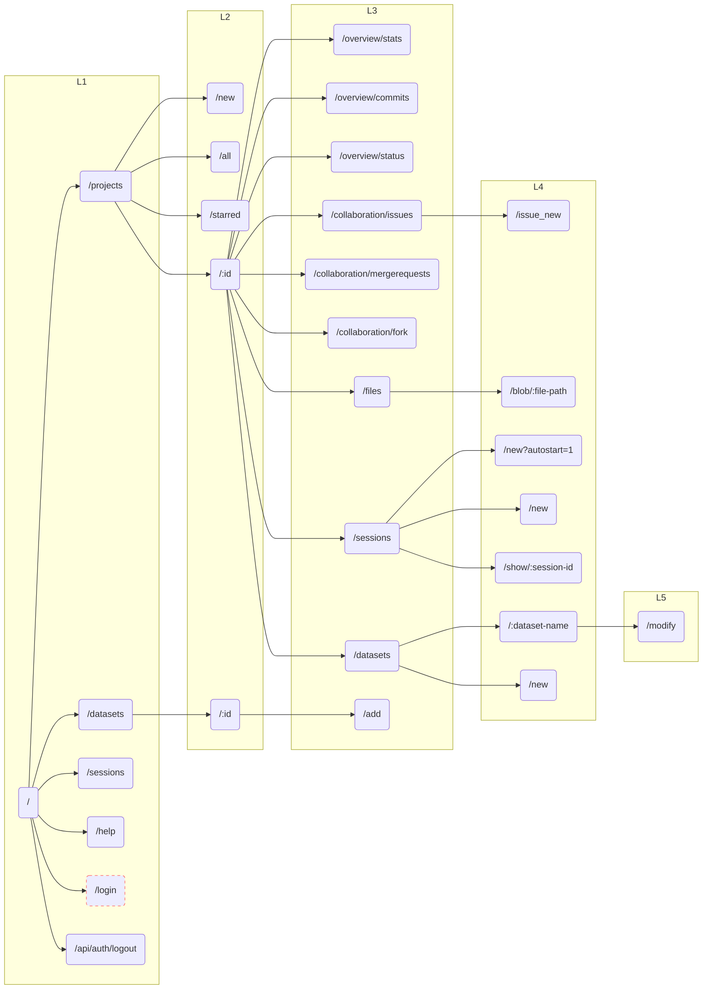
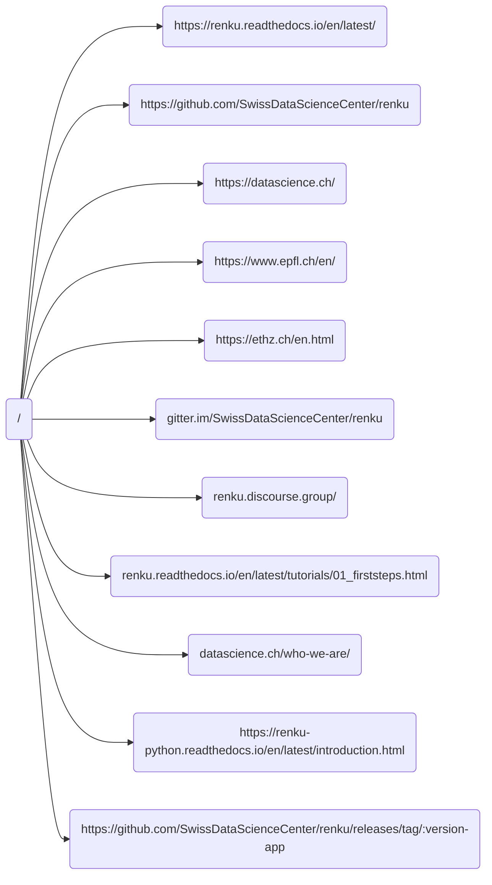

[](https://github.com/SwissDataScienceCenter/renku-ui/actions?query=branch%3Amaster+workflow%3A%22Test+and+CI%22)
[](https://conventionalcommits.org)
[](https://github.com/SwissDataScienceCenter/renku-ui/releases)

# Renku-UI

## Quickstart

The Renku ui depends on a running instance of Renku being present. More
precisely, it relies on a running instance of the [Renku
Gateway](https://github.com/SwissDataScienceCenter/renku-gateway) that
acts as an interface to all backend services APIs, handling
authentication and exchanging access tokens. Follow these
[instructions](https://renku.readthedocs.io/en/latest/how-to-guides/admin/deploying-renku.html)
to get Renku up and running. You can also deploy an environment in a
remote development cluster.

TRIGGER IT!

## Developing the UI

Once you have a development instance of Renku running locally or in the
cloud, you can install
[telepresence](https://www.telepresence.io/reference/install) locally
and run the `run-telepresence.sh` script in the client or
the server folder. Don't forget to run install before running telepresence for the first time or
after any package change.

    $ cd client   # or server if you need to work there
    $ npm install
    $ ./run-telepresence.sh

Telepresence replaces the selected UI pod in the target Kubernetes
instance. All the traffic is then redirected to a local process, making
all the changes to files almost immediately available in your
development RenkuLab instance.

The `run-telepresence.sh` scripts support out-of-the-box
[telepresence](https://www.telepresence.io/reference/install) minikube
and the Renku team [switch-dev]{.title-ref} cloud. You need to properly
set the environment variable `CURRENT_CONTEXT` to either `"minikube"` or
`"switch-dev"`.

There are a few other environment variables you may want to set when
starting telepresence if you are going to to take advantage of the Renku
team internal development infrastructure:

-   SENTRY: set to 1 to redirect the exceptions to the dev
    [sentry](https://sentry.dev.renku.ch) deployment
-   PR: set to the target PR number in the
    [renku-ui](https://github.com/SwissDataScienceCenter/renku-ui/pulls)
    repo to work in the corresponding CI deployment


```
    $ SENTRY=0 PR=1166 ./run-telepresence.sh
```
There are other variables used in the `run-telepresence.sh` script. For
specific use cases, you may want to modify some values manually.

## Tests

We use [jest](https://jestjs.io) as our default testing framework and
[eslint](https://eslint.org/) as linter. Mind that we require both
commands to terminate without warnings before we merge a PR. You can
manually run tests using the following commands:

    $ cd client   # or server if you need to work there
    $ npm test
    $ npm run lint

Some linting errors can be automatically fixed by running
`npm run lint-fix`. We suggest using an IDE that supports eslint (like
[vscode](https://code.visualstudio.com) or similar) to get realtime
feedback when modifying the code.

## Site navigation map
Note: stroke-dasharray when the link is only for anonymous users


External links map


