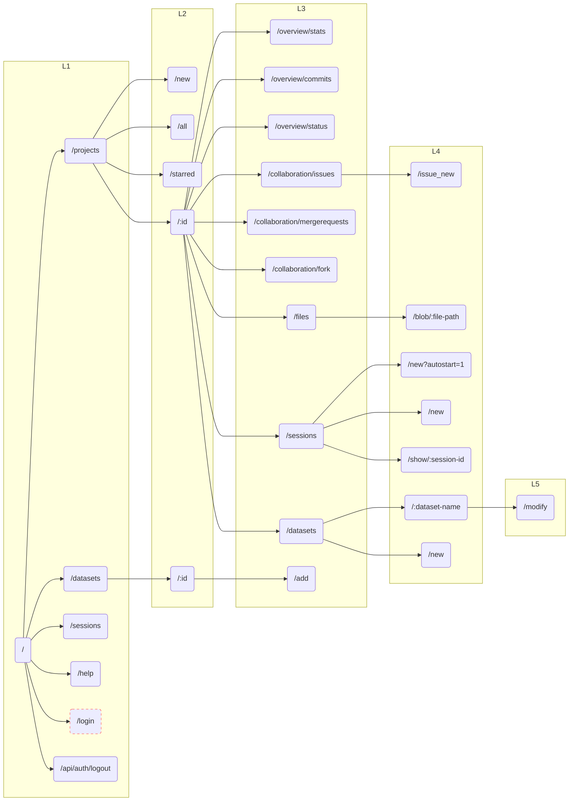
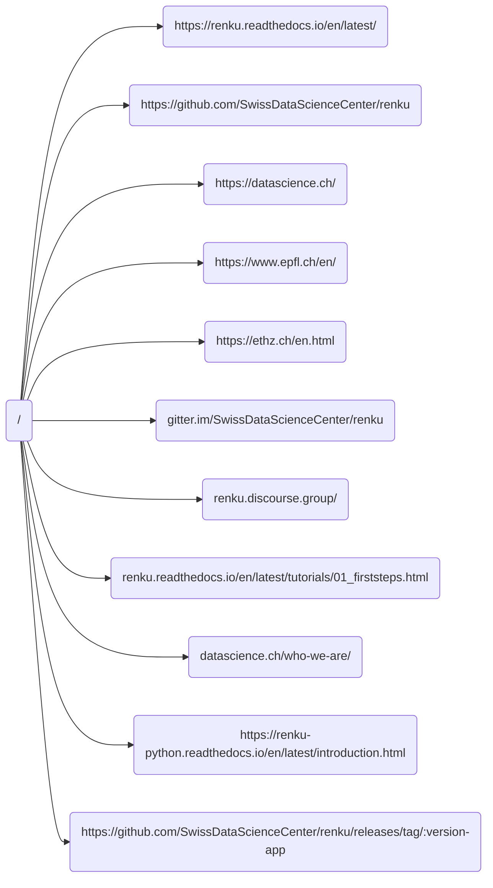

[](https://github.com/SwissDataScienceCenter/renku-ui/actions?query=branch%3Amaster+workflow%3A%22Test+and+CI%22)
[](https://conventionalcommits.org)
[](https://github.com/SwissDataScienceCenter/renku-ui/releases)

# Renku UI

The web-based UI for [Renku](https://github.com/SwissDataScienceCenter/renku).

This README contains information relevant to contributors to the renku-ui component. To deploy RenkuLab, including the UI, see the [Administrator's Guide](https://renku.readthedocs.io/en/latest/how-to-guides/admin/deploying-renku.html).

# Architecture

The Renku UI is made up of two subcomponents, which are each packaged as [Docker](https://www.docker.com) containers and are deployed using [Kubernetes](https://kubernetes.io).

|        |                                                 |
|--------|-------------------------------------------------|
| client | [React-based](https://reactjs.org) front-end    |
| server | [Express-based](https://expressjs.com) back-end |

Below, we explain each of those components in greater detail and guidelines for developing code within them.

# Prerequisites

To develop on this codebase, you will want the following tools installed.


|                                                                      |                                                                     |
|----------------------------------------------------------------------|---------------------------------------------------------------------|
| [docker](https://www.docker.com)                                     | For building containers                                             |
| [helm](https://helm.sh)                                              | For packaging things for K8s                                        |
| [kubectl](https://kubernetes.io/docs/tasks/tools/)                   | K8s command-line tool                                               |
| [nvm](https://github.com/nvm-sh/nvm)                                 | NVM or some similar tool for managing node environments             |
| [telepresence](https://www.telepresence.io/docs/latest/quick-start/) | Tool for redirecting requests to your local development environment |

You should use your **node version manager** to install the node version specified in the [Dockerfile](https://github.com/SwissDataScienceCenter/renku-ui/blob/master/client/Dockerfile).


# Client

The client is the [React-based](https://reactjs.org) front-end for RenkuLab. Development started in 2017, and, in the intervening years, we have striven to change our development style to reflect the evolving best practices around the tools we use. You will see that not all code conforms to the guidelines laid out in this document, but **new code** should follow these guidelines, and older code should be refactored at opportune moments, whenever possible, to conform as well.


## Tool Stack

| Framework                                     | Purpose                                       |
|-----------------------------------------------|-----------------------------------------------|
| [Bootstrap](https://getbootstrap.com)         | Responsive grid, HTML styling, and components |
| [Cypress](https://www.cypress.io)             | UI testing framework                          |
| [React](https://reactjs.org)                  | Reactive component framework                  |
| [Reactstrap](https://reactstrap.github.io/)   | React bindings for Bootstrap                  |
| [Redux Toolkit](https://redux-toolkit.js.org) | State and React-integration components        |
| [Storybook](https://storybook.js.org)         | UI component documentation                    |
| [TypeScript](https://www.typescriptlang.org)  | JavaScript extension with static typing       |


## Unit Tests and Linting

We use [jest](https://jestjs.io) as for unit tests and
[eslint](https://eslint.org/) to detect trivial errors and enforce some coding-style preferences. We require both
commands to terminate without warnings before we merge a PR. You can
manually run tests using the following commands:

    $ cd client   # or server if you need to work there
    $ npm test
    $ npm run lint

Some linting errors can be automatically fixed by running
`npm run lint-fix`.

We suggest using an IDE that supports eslint (like [VS Code](https://code.visualstudio.com) or similar) and configuring your IDE to integrate with our eslint configuration so that any linting errors will be displayed as you develop rather than waiting for the CI pipeline to flag them.

## Developing

As you would expect for a React-based project, you can install the client using `npm`.

    $ cd client
    $ npm install

This will install the toolchain for developing the client as well as any libraries used in the UI.

To run and interact with the UI code on your development machine, you can either use the Cypress tests, which provide mocked responses from the backend, or use telepresence to replace the UI client component in a K8s-based deployment with the component running on your machine.

### Cypress

We have an ever-growing suite of UI tests developed with Cypress. The tests can be run with mock responses from the backend, and can therefore be used to try out changes to the UI without access to a development cluster.

    $ cd tests
    $ npm install
    $ npm run e2e:local

### Telepresence

Telepresence can be used to develop the UI in a realistic setting. The client folder includes a `run-telepresence.sh` script that is tailored for the SDSC development cluster.

    $ cd client
    $ ./run-telepresence.sh

Telepresence replaces the UI client pod in the target Kubernetes instance. All the traffic is then redirected to a local process, making changes to files almost immediately available in your development RenkuLab instance.

The `run-telepresence.sh` script uses the current K8s context as returned by `kubectl config current-context`. You can deploy your own RenkuLab application (using the helm chart in the renku repository) for development; alternatively the renku-ui repository includes CI tasks that can deploy the code for a PR. To take advantage of this task, add

```
/deploy #persist
```

To the body of your PR description.

There are a few environment variables you may want to set when starting telepresence if you are going to to take advantage of the Renku team internal development infrastructure:

-   SENTRY: set to 1 to redirect the exceptions to the dev [sentry](https://sentry.dev.renku.ch) deployment
-   PR: set to the target PR number in the [renku-ui](https://github.com/SwissDataScienceCenter/renku-ui/pulls) repo to work in the corresponding CI deployment
-   DEV_NAMESPACE: if you do not target a PR deployment you should specify a value for this to reference the namespace with your development deployment


For example:
```
    $ SENTRY=0 PR=1166 ./run-telepresence.sh
```

There are also further configuration possibilities offered by the  `run-telepresence.sh` script. For
specific use cases, you may need to modify the script directly, since not all options are configurable through environment variables.

## Coding Guidelines

As explained above, not all the code in the repo conforms to these guidelines, but this section explains how code _should_ be developed in the repo.

### **Use Typescript**

New code should be developed in TypeScript, and older code should be converted to TypeScript whenever feasible.

### **React components should be functional and take advantage of hooks**

* Use `useState` to manage component-local state
* Use `useEffect` for handling the component lifecycle

### **Application state is managed by Redux**

We follow the [redux-toolkit](https://redux-toolkit.js.org/tutorials/typescript) style for interacting with Redux. If you are not familiar with this, follow the link to see the tutorial.

Key points around this include:

* Global application state is kept in a single, global [Redux](https://redux.js.org) store
* Features (see below) should make [slices](https://redux-toolkit.js.org/usage/usage-with-typescript#createslice) that encapsulate the state they need and add the slices into the [global store](https://redux-toolkit.js.org/api/configureStore).
* Use the `useSelector` hook to access information from slices in components
* Use the `useDispatch` hook to make changes to state in components

### **Interact with backend services using RTK Query**

[RTK Query](https://redux-toolkit.js.org/tutorials/rtk-query) greatly simplifies interacting with other services. It automatically provides integration with the Redux store and handles caching of responses and transitions through the request lifecycle (e.g., _fetching_, etc.).

### **Group shared code into features**

[Features](https://redux.js.org/faq/code-structure) should be used to group together UI components and state manipulation code.

It commonly happens that there are multiple components and multiple state interactions that center around one shared slice and/or one backend API. These should be grouped into a feature to make this structure easier to work with.

# Server

The server is the [Express-based](https://expressjs.com) back-end for the RenkuLab UI. At first, the front-end would interact directly with back-end services, but this structure imposed some limitations and complications, so we introduced a server component with the sole responsibility of serving the UI and simplifying interactions with the other backend services.

In many cases, the server just forwards requests to the appropriate service, and is therefore a much smaller and simpler codebase than the client. Where appropriate, though, the server can be used to implement logic or interact with multiple services to provide a more unified view to the client. The server manages websockets to send asynchronous notifications to clients when important events occur.

## Tool Stack

| Framework                                                            | Purpose                                       |
|----------------------------------------------------------------------|-----------------------------------------------|
| [Express](https://expressjs.com)                                     | Route and respond to HTTP requests            |
| [Morgan](https://expressjs.com/en/resources/middleware/morgan.html)  | Logging middleware for express                |
| [TypeScript](https://www.typescriptlang.org)                         | JavaScript extension with static typing       |
| [WS](https://www.npmjs.com/package/ws)                               | WebSocket framework                           |


## Unit Tests and Linting

As with the client, we use [jest](https://jestjs.io) as for unit tests and
[eslint](https://eslint.org/) to detect trivial errors and enforce some coding-style preferences. We require both
commands to terminate without warnings before we merge a PR. You can
manually run tests using the following commands:

    $ cd server
    $ npm test
    $ npm run lint

Some linting errors can be automatically fixed by running
`npm run lint-fix`.

We suggest using an IDE that supports eslint (like [VS Code](https://code.visualstudio.com) or similar) and configuring your IDE to integrate with our eslint configuration so that any linting errors will be displayed as you develop rather than waiting for the CI pipeline to flag them.

## Developing

You can install the server using `npm`.

    $ cd server
    $ npm install

This will install the toolchain for developing the server as well as any libraries used.

To run and interact with the server code on your development machine, you will need to use telepresence to replace the UI server component in a K8s-based deployment with the component running on your machine.

### Telepresence

The server folder includes a `run-telepresence.sh` script that is tailored for the SDSC development cluster.

    $ cd server
    $ ./run-telepresence.sh

Telepresence replaces the UI server pod in the target Kubernetes instance. All the traffic is then redirected to a local process, making changes to files almost immediately available in your development RenkuLab instance.

The instructions for deploying the renku application into K8s are the same as in the client, so see that section for those details. There are some small differences in how the server `run-telepresence.sh` script works compared to the client.

* In the server, `run-telepresence.sh` will prompt you to provide or override the deployment you want to intercept. You can enter the id of a PR to intercept the deployment associated with a GitHub PR.
* By default, the script will start the server and wait for a debugger to attach. Instead, you can start in _console mode_ and start the server yourself by running `npm run dev-debug` (within a debugger).

For the default mode of the script, you will need to attach a debugger to finish bringing the server up. In VS Code, you can add a **Node Attach** run configuration for this. It will look something like:

```
{
    "version": "0.2.0",
    "configurations": [
        {
            "name": "uiserver",
            "type": "node",
            "request": "attach",
            "address": "localhost",
            "port": 9229,
            "protocol": "inspector",
            "restart": true
        }
    ]
}
```

With this configuration, after running `run-telepresence.sh` you should invoke the _Run > Start Debugging_ in VS Code to attach the debugger.

# Site navigation map
Note: stroke-dasharray when the link is only for anonymous users


External links map


