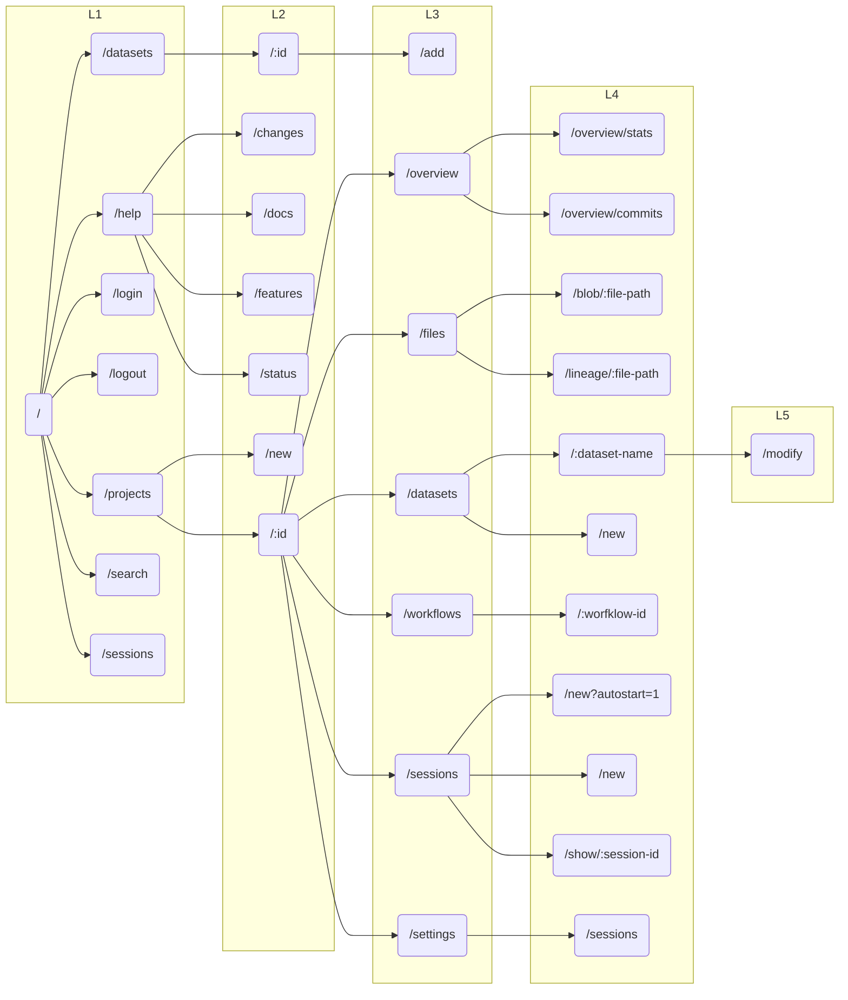
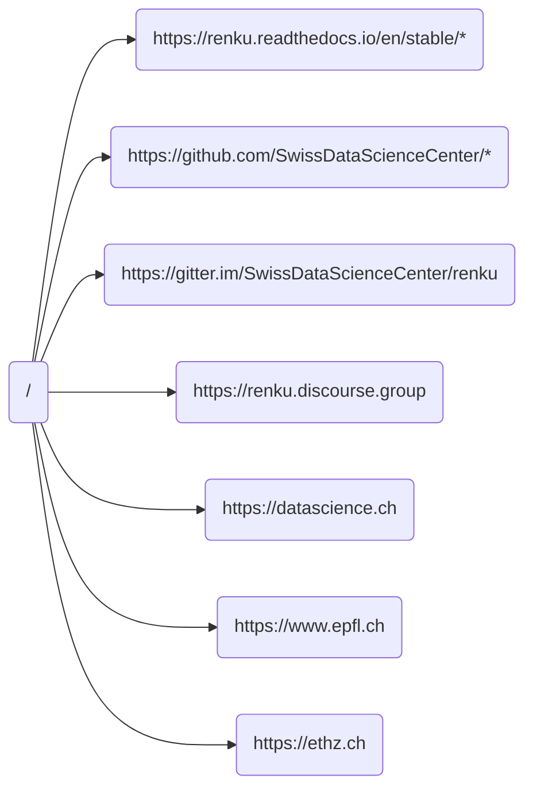

[](https://github.com/SwissDataScienceCenter/renku-ui/actions/workflows/test-and-ci.yml)
[](https://conventionalcommits.org)
[](https://github.com/SwissDataScienceCenter/renku-ui/releases)

# Renku UI

The Renku UI is the web-based UI for [Renku](https://github.com/SwissDataScienceCenter/renku)
and it requires a RenkuLab deployment. You can check the
[Administrator's Guide](https://renku.readthedocs.io/en/latest/how-to-guides/admin/deploying-renku.html)
to get more information.

## Architecture

The Renku UI is made up of two subcomponents, which are each packaged as [Docker](https://www.docker.com) containers and are deployed using [Kubernetes](https://kubernetes.io).

|                         |                                                 |
| ----------------------- | ----------------------------------------------- |
| [UI Client](#ui-client) | [React-based](https://reactjs.org) front-end    |
| [UI Server](#ui-server) | [Express-based](https://expressjs.com) back-end |

To develop on this codebase, you will want the following tools installed.

|                                      |                                                     |
| ------------------------------------ | --------------------------------------------------- |
| [node](https://nodejs.org)           | Node JavaScript execution environment               |
| [npm](https://github.com/npm/cli)    | Node package manager                                |
| [nvm](https://github.com/nvm-sh/nvm) | NVM or some similar tool for managing Node versions |

Node is a requirement; when you install node, you will probably also get npm
automatically. Though not absolutely necessary, we recommend using a node version
manager like nvm to manage node/npm installations.

However you get it, you need the node version specified in the [Dockerfile](https://github.com/SwissDataScienceCenter/renku-ui/blob/master/client/Dockerfile).

## Development

You don't need much to start developing, at least for the
[UI Client](#ui-client). If you are content with testing your changes using
[Cypress](https://www.cypress.io), no additional tools are strictly needed.
The [UI Server](#ui-server) requires a full RenkuLab deployment. You can
find more information in the UI server section.

To start your journey, clone this repository and install the dependencies
using npm:

    $ npm install

### Coding guidelines

We have a [coding guidelines](CODING_GUIDELINES.md) document that explains how
to write code for this repository. We suggest you read it before starting to
develop.

Please note that not all the code in the repository follows the guidelines
since they were introduced later in the project. We are working on refactoring
the codebase to make it consistent, and guidelines will be enforced for all new
code.

### Code Formating

We use [Prettier](https://prettier.io) to format the codebase to
keep the syntax consistent. We enforce that by checking every pull request
and the CI pipelines will fail in case of formatting issues.

You can manually format the code by running `npm run format` in the `client`,
`server` or `tests` folder.

This repository is configured to automatically format the files on
commit through [git hooks](https://git-scm.com/book/en/v2/Customizing-Git-Git-Hooks).
To set them up, we use [Husky](https://typicode.github.io/husky).
You can install Husky and the git hooks by running `npm install` from the
base folder on this repository.

If you use [VS Code](https://code.visualstudio.com), you can also install the
`esbenp.prettier-vscode` extension to run Prettier each time you save files.
After installing it, go to the workspace settings, search for
`editor.defaultFormatter` and set it to `Prettier`, then search for
`editor.formatOnSave` and turn on "Format on save".

### Additional tools

If you want to develop and test your changes against a real RenkuLab deployment
or if you wish to develop on the [UI Server](#ui-server), then you will need a
few more tools to deal with the infrastructure.

|                                                                      |                                                                     |
| -------------------------------------------------------------------- | ------------------------------------------------------------------- |
| [kubectl](https://kubernetes.io/docs/tasks/tools/)                   | K8s command-line tool                                               |
| [telepresence](https://www.telepresence.io/docs/latest/quick-start/) | Tool for redirecting requests to your local development environment |

Kubectl and telepresence will allow you to inject code running on your development machine into a K8s deployment. These two tools will be sufficient if you do not need to deploy the renku application into K8s yourself. If you **do** need to do that, then you will additionally need:

|                                  |                              |
| -------------------------------- | ---------------------------- |
| [docker](https://www.docker.com) | For building containers      |
| [helm](https://helm.sh)          | For packaging things for K8s |

## UI Client

The UI client is the [React-based](https://reactjs.org) front-end for RenkuLab.
Development started in 2017, and we have striven to change our development style
to reflect the evolving best practices around the tools we use.

Not all code conforms to the guidelines and best practices laid out in this
document and you might find older code using deprecated technologies. That will
be refactored in the future.

We use [TypeScript](https://www.typescriptlang.org) in all new code but we still
have a lot of JavaScript code.

### Tool Stack

This is a list of the main tools we use in the client and you need to know to
develop it.

| Framework                                     | Purpose                                      |
| --------------------------------------------- | -------------------------------------------- |
| [React](https://reactjs.org)                  | Reactive component framework                 |
| [Redux](https://redux.js.org)                 | Centralized state management                 |
| [Redux Toolkit](https://redux-toolkit.js.org) | State integration and fetching/caching tools |
| [Bootstrap](https://getbootstrap.com)         | CSS framework based on a responsive grid     |

Mind that we try to take advantage of the latest features of React and Redux,
and to integrate the two tools as seamlessly as possible.

For this reason, please follow these simple best practices when dealing with new
React components:

- Use `useState` to manage component-local state
- Use `useEffect` for handling the component lifecycle

When dealing with the state, we follow the
[redux-toolkit](https://redux-toolkit.js.org/tutorials/typescript) style for interacting
with Redux. If you are not familiar with this, follow the link to see the tutorial.

In short:

- Global application state is kept in a single, global [Redux](https://redux.js.org) store.
- Features should have
  [slices](https://redux-toolkit.js.org/usage/usage-with-typescript#createslice) that
  encapsulate the state they need and add the slices into the
  [global store](https://redux-toolkit.js.org/api/configureStore).
- Use slice-specific selector hooks (e.g.
  [useWorkflowsSelector](https://github.com/SwissDataScienceCenter/renku-ui/blob/master/client/src/features/workflows/WorkflowsSlice.ts)),
  or the `useSelector` hook to access global state.
- Use the `useDispatch` hook to make changes to the state in components.

Also, please use [RTK Query](https://redux-toolkit.js.org/tutorials/rtk-query) to
interact with backend services. It greatly simplifies writing the code to fetch and
cache data, as well as handling the transitions through the request lifecycle.

### Code structure

Based on [these suggestions from Redux](https://redux.js.org/faq/code-structure), we decided to use a few folders to bundle functions and components together, broadly following the "Feature folders" style.

Here are the folders in `/client/src` where to place new components:

- `features`: create/use sub-folders to contain files identifying single features.
  These sometimes correspond to Renku abstractions, like "Projects", "Datasets",
  "Sessions", or to cross-entity features such as "Search" and "Dashboard".
  Wherever relevant, please add `*.api.ts` files containg the RTK queries and `*.slice.ts`
  files for slices.
- `components`: add here components that can be reused in different contexts. If
  something is clearly a shared component (e.g. `RenkuAlert`), put it here. If it's
  not obvious, and currently used by just one component, you can leave it in the
  `feature` folder (follow the principle: do not over-engineer it too early).
  Mind that we also store most of the temporary values in the Redux store, so you
  can define actions here if necessary.
- `utils`: put here anything generic that doesn't fall into the previous categories
  (e.g. constants, helper functions, wrappers).

Picking the perfect place isn't always straightforward and our current folder structure
still has many outdated components that don't follow the convention. We plan to move
them when already touching the code for other changes.

#### **Use CSS modules for local styles**

We use [CSS modules](https://github.com/css-modules/css-modules) to apply CSS styles
locally and avoid leaking styles to the whole web application.
No additional configuration is needed since Create React App [supports CSS modules out of the box](https://create-react-app.dev/docs/adding-a-css-modules-stylesheet).

### Code splitting

If a component requires a large package, it can be loaded on demand by using the `lazy()` function from React.

Here is an example:

- The component itself: [NotebookRender.tsx](./client/src/components/notebook/NotebookRender.tsx)
- The wrapper allowing for lazy loading: [LazyNotebookRender.tsx](./client/src/components/notebook/LazyNotebookRender.tsx)

In this case, we save ~950kB from being included in the final bundle.

### Testing

We split testing into multiple categories. All these tests are required to pass
before we merge a PR.

#### Unit tests

We use [jest](https://jestjs.io) _only_ for unit testing.

Unit tests are used to test individual functions. We don't have a fixed rule for
the amount of coverage we require, but we try to cover all the helper functions and
the most important functions used by components. Note, we do not test components
using jest/jsdom anymore. Tests that require a browser/DOM environment are implemented
either in Storybook or Cypress (see below). There might be legacy tests that still
use `jest` with components.

Files containing unit tests are named `*.test.ts`. Usually, they refer to a specific
file in the `src` folder, so you can find the tests for `src/*/MyComponent.tsx`
in `src/*/MyComponent.test.ts`.

You can run the unit tests manually using the following command in the client
subfolder:

    $ cd client
    $ npm test

#### Component tests

We use [Storybook](https://storybook.js.org) to test single React components in isolation.
This tool allows us to create interactive stories and to keep track of all the reusable
components we implemented.
_Mind that this is a recent introduction so you can expect quite a few components to be
missing._

Storybook files are named `*.stories.tsx` and refer to specific components.
The overhead of writing stories is rather low, so we encourage you to write them
for all new components.
Whether to write stories for specific components depends on the size and re-usability
of the component. The more simple and reusable a component is, the more important
it is to have a story for it.
Be sure to check out the full documentation [here](https://storybook.js.org/docs/react/writing-stories/introduction).

You can run component tests using the following command:

    $ npm run storybook-compile-and-test

If you wish to check the components, you can use the Storybook interface. To start it,
run:

    $ npm run storybook

This should also open your browser automatically. If it doesn't, you can visit
http://localhost:6006 to see the Storybook interface.

> Mind that we deploy Storybook automatically in each RenkuLab deployment. You can
> access it at `https://<renkulab-url>/storybook/`.

##### Storybook best practices

Here are a few rules to follow when writing new stories:

- Use the `title` property in the story definition to group related stories by categories.
  You can find an example in `components/buttons/buttonWithMenu`.
- It's good to showcase different variations of your component. Use multiple stories to demonstrate
  how props and states affect the component and how that helps in serving different use cases.
- Provide a clear and concise description for each story; feel free to include details on the usage
  whenever necessary.
- Use `Args` to tweak props' values, making the components interactive so that users can play with them.
- Include stories that demonstrate responsiveness across different devices wherever it's relevant.
- You can use `addon-redux` for state management on components that require to get data from the
  Redis store.

#### End-to-end tests

For testing interactions between multiple components or slices of pages, as well as some
common scenarios (or uncommon, like specific error cases), we use
[Cypress](https://www.cypress.io).

Cypress tests are located in the `tests` folder and are named `*.spec.ts`. We don't have a
fixed naming convention for them, but we try to group tests based on features instead of
single components. For this reason, some components might be tested in multiple spec files,
while others get less coverage.

Keep in mind we test real scenarios and we try to simulate users interacting with the
platform. Since our goal is to catch non-obvious regressions, we mock backend
responses in different scenarios, including errors and other edge cases. They _do_
occasionally occur in our platform, especially since users can change a lot of things
in their projects and break them in creative ways, so the best we can do is handle
errors gracefully and provide meaningful feedback to the user so that they can recover
whenever possible.

Cypress is also a great tool to run components in the browser and debug them. Most of the
time, you don't need the whole platform to develop or update a component, so you can
use Cypress to develop the UI without a dedicated RenkuLab deployment.

You can run Cypress tests using the following command:

    $ cd tests
    $ npm run e2e

### Utilities and additional information

Here are other information that might be useful.

#### Craco

We are using [Craco](https://craco.js.org) to override default settings from
[Create React App](https://create-react-app.dev).
Since CRA is not actively maintained, we might move away soon from this stack.

In the meanwhile, mind that Jest cannot be run outside of Craco's context;
if you ever need to debug your tests using advanced features like `node --expose-gc`
or `node --inspect-brk`, you have to reference Jest from
`./node_modules/@craco/craco/dist/bin/jest`.

The following example shows how to check for memory leaks:

    $ node --expose-gc ./node_modules/@craco/craco/dist/bin/jest --runInBand --logHeapUsage *

#### Deployments

As already mentioned, you don't strictly need a full RenkuLab deployment for the client.
Using Cypress, you can test your changes against a mocked backend; otherwise, you can run
the client locally and point to a development instance like `https://dev.renku.ch` or one
of the CI deployments made on each PR.

#### Telepresence

If you are part of the Renku team, you should have full access to the development
infrastructure.

In this case, you can use [Telepresence](https://www.telepresence.io) to develop the UI
in a realistic setting. The client folder includes a `run-telepresence.sh` script that
is tailored for the SDSC development cluster.

Try to run it to get more instructions:

    $ cd client
    $ ./run-telepresence.sh

Telepresence replaces the UI client pod in the target Kubernetes instance. All the traffic
is then redirected to a local process, making changes to files almost immediately available
in your development RenkuLab instance.

##### Configuration

The script allows configuration of certain aspects of the deployment through environment
variables. Take a look at the script to see all the options that are available.
The script generates a `config.json` file into the `client/public` folder, and you can
modify this file with a text editor and reload the browser to test out different
configuration settings.

#### Bundle analysis

The [`webpack-bundle-analyzer`](https://github.com/webpack-contrib/webpack-bundle-analyzer) plugin can be used to analyze the final bundle and see which Node packages take up a lot of space.

Use the `build:analyze` script to start it:

```bash
$ npm run build:analyze
```

### Navigation map



External links map



## UI Server

The UI server is the [Express-based](https://expressjs.com) back-end for the UI client.
All code is written in [TypeScript](https://www.typescriptlang.org).

The main responsibilities of the server include:

- Managing access tokens.
- Creating a WebSocket client that can invoke APIs on behalf of the user.
- Storing temporary data for the client (e.g. recent searches and recently
  visited projects or).

Though the server is the first recipient of service requests from the client,
in most cases the server just forwards requests to the appropriate service with the
access tokens attached. For this reason, the codebase is much smaller and simpler
than the client.

### Tool Stack

| Framework                                                           | Purpose                            |
| ------------------------------------------------------------------- | ---------------------------------- |
| [Express](https://expressjs.com)                                    | Route and respond to HTTP requests |
| [Morgan](https://expressjs.com/en/resources/middleware/morgan.html) | Logging middleware for express     |
| [WS](https://www.npmjs.com/package/ws)                              | WebSocket framework                |

We use Express to handle HTTP requests and WS to handle WebSocket connections.

### Code structure

We have an abstraction for storage in the `storage` folder. Currently, we support
only Redis, and we do not currently to use the UI server to store non-volatile data.
We use Redis to store user tokens and temporary data.

The authentication logic is in the `authentication` folder, including the middleware
to add tokens to the queries.

The WebSocket logic is in the `websocket` folder. There is a fixed structure for the
messages between the server and the client. Should you need to add support for new
messages, please add a new function in the `handlers` section and configure the handler
in the index file.

Finally, we configure the routes in the `routes` folder. There is little to change
there since the Server should have very limited logic to handle requests.

### Testing

As with the client, we use [Jest](https://jestjs.io) for unit tests.
We should improve the coverage since it's pretty low at the moment.

You can manually run tests using the following commands:

    $ cd server
    $ npm test

### Utilities and additional information

Here are other information that might be useful.

#### Deployments

We don't have any abstraction of the resources needed by the UI server, so we
rely on an existing deployment of RenkuLab to run it.

#### Telepresence

If you are part of the Renku team, you should have full access to the development
infrastructure and you can use [Telepresence](https://www.telepresence.io) to
develop the UI server.

Try to run the `run-telepresence.sh` script to get more instructions:

    $ cd server
    $ ./run-telepresence.sh

Telepresence replaces the UI server pod in the target Kubernetes instance. All the traffic
is then redirected to a local process, making changes to files almost immediately available
in your development RenkuLab instance.
