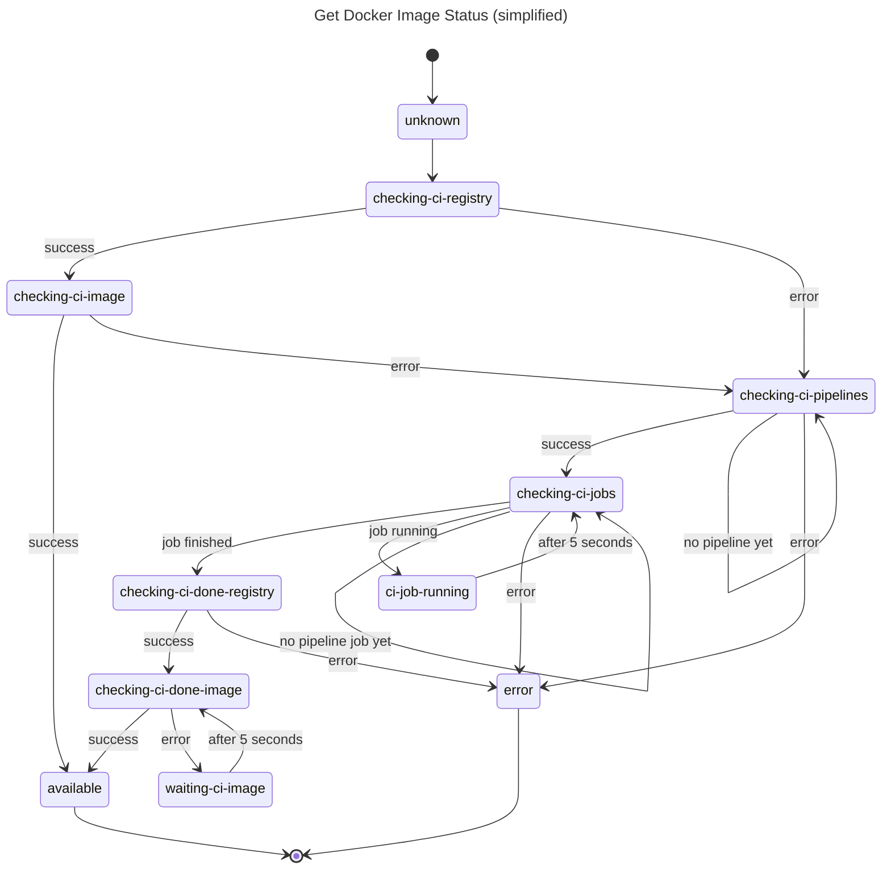

# SessionProjectDockerImage

Documentation on the state machine used in `SessionProjectDockerImage` which
provides the current state of a project's Docker image ("available",
"not-available", "building").

The actual state machine also has states with `<state>-start`. These states
exist to make sure the associated API queries are fired only once, as the
state machine goes from `<state>-start` to `<state>` when the API query is
resolved.
