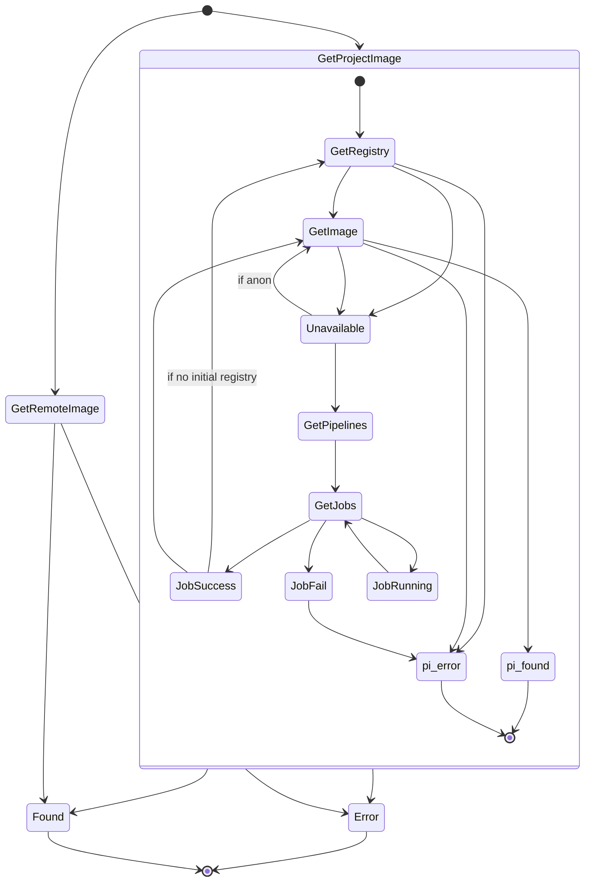

# Session Support

The logic behind sessions is complex because the process of identifying if a session can be started is complicated.

# Find image

```mermaid
stateDiagram-v2
    [*] --> GetRemoteImage
    [*] --> GetProjectImage

    GetProjectImage --> Error
    GetProjectImage --> Found

    GetRemoteImage --> Error
    GetRemoteImage --> Found

    Found --> [*]
    Error --> [*]

    state GetProjectImage {
      [*] --> GetRegistry

      GetRegistry --> pi_error
      GetRegistry --> GetImage
      GetRegistry --> Unavailable

      GetImage --> pi_error
      GetImage --> pi_found
      GetImage --> Unavailable

      Unavailable --> GetImage: if anon
      Unavailable --> GetPipelines
      GetPipelines --> GetJobs
      GetJobs --> JobSuccess
      GetJobs --> JobFail
      GetJobs --> JobRunning

      JobSuccess --> GetRegistry: if no initial registry
      JobSuccess --> GetImage
      JobFail --> pi_error
      JobRunning --> GetJobs

      pi_found --> [*]
      pi_error --> [*]
    }
```
