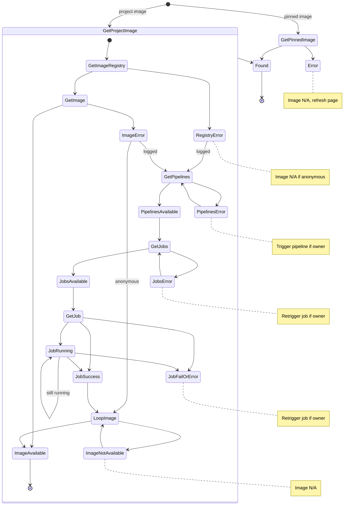

# Session Support

The logic behind sessions is complex because the process of identifying if a session can be started is complicated.

Here is a recap. When reaching an error state, we generally keep polling the resource,
but we also show immediate feedback to the user since it's unlikely we can recover (see labels).
Project owners can usually trigger actions to start pipelines or jobs again.

# Find image

