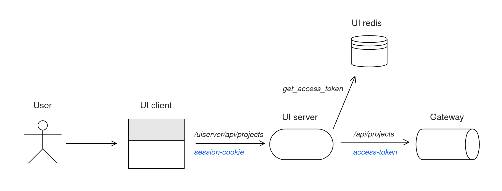
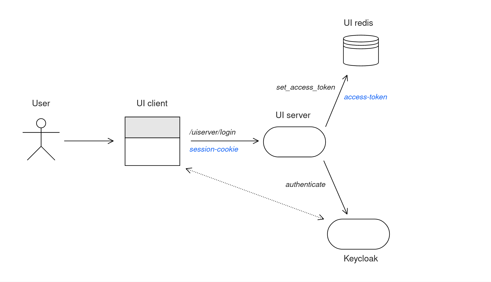

# UI server

The UI server is based on the [Backend for Fronted (BFF)](https://samnewman.io/patterns/architectural/bff) architecture and it is intended to take some burdens off the UI client and handle them more efficiently.

Specifically, it is (or will be) in charge of:
- Authentication: query the authentication server to get access tokens and use the refresh tokens
  to refresh credentials whenever needed.
- Aggregate APIs: hide some of the complexity we currently have due to different sources providing
  different data on the same resouce (E.G. dataset information partially available from the core
  service and the knowledge graph service).
- Cache data: polling for those resources that don't have event based APIs and notify the UI about
  changes.

## Architecture

The UI server is made by one shared [Redis](https://redis.com) instance, acting as a
semi-permanent storage, and one or more [Node.js](https://nodejs.org) instances, acting as
(web) servers.

Requests come from the UI client running in the user browser.

If the request should be forwarded, the server checks for existing credentials and it attaches
the access token when a valid one is available (or refresh it if possible).
The request is then forwarded to the gateway and the result returned back to the UI.

In this case, errors are not handled. For example, a 404 response is simply forwared to the UI
client that can decide to either display a feedback to the user or trigger the authentication.



Other requests are handled directly by the service, and those may use Redis to store data.
Among those there are requests requiring aggregations from multiple endpoints, and all the
authentication related endpoints.

The first category is handled similar to the forwared requests, but the final 
response is generated only when all the endpoints have responded, and partial failures
are not reported as full error.\
The second category is fully managed by the service, errors included.



## Developing the UI server

Once you have a development instance of Renku running locally or in the cloud,
you can [install telepresence v1](https://www.telepresence.io/docs/v1/reference/install).
Clone the repository and run `npm install` (remember to re-run it every time there are
changes on the requirements file!).
Now you can start a development environment by using the `run-telepresence.sh` script from the `server` folder.

The script will print some information, ask you for an admin password (required by telepresence) and then run the npm server.

**TIP**: If you need to debug, you should set the environment variable `DEBUG=1`.\
That supports also attaching external debuggers to hit breakpoints (E.G. [VScode](https://code.visualstudio.com)).

```
$ cd server
$ npm install
$ DEBUG=1 ./run-telepresence.sh
```

**TIP**: When you are developing, you may need to restart the server after a crash. Re-creating
the telepresence pod each time you save a file is tedious. You could instead enable the console
mode by setting `CONSOLE=1`. This will give you access to a console on the pods where you can
start and stop the service manually. Keep in mind it's a bit more fragile and you may accidentally have stale services hanging on the target port.

```
$ cd server
$ CONSOLE=1 ./run-telepresence.sh
(tel)$ npm run dev-debug
```
