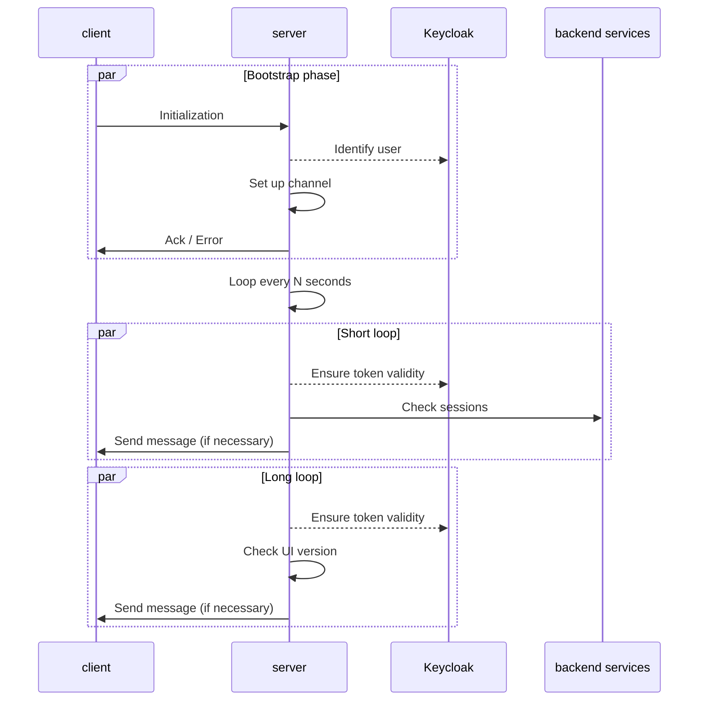
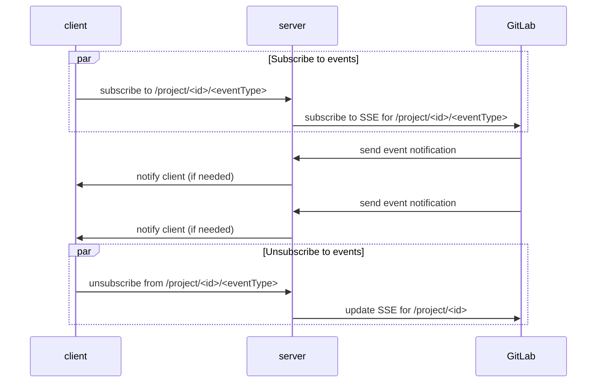

# WebSocket

WebSocket allows the UI server to push notifications directly to the UI client through a
bi-directional communication channel after an initial setup that helps identify the user.

Our current implementation relies on the client opening the connection and sending commands
that can be interpreted by the server (thorugh an extensible system)[#-extend-the-supported-commands]. When needed, the server can repeat actions on behalf
of the user every 5 seconds or 3 minutes, and cache some data locally.

This way, we can remove client-side polling functions and improve the client reactivity
to backend changes, preventing the interface from showing stale content without
appropriately notifying the user.

## Why WebSocket?

There aren't many well-established technologies to create a channel allowing the server to
send data to the client. The final choice between
[WebSocket](https://en.wikipedia.org/wiki/WebSocket) and
[Server-sent events](https://en.wikipedia.org/wiki/Server-sent_events) has seen the first
prevail since it also enables the client to send messages to the server.
Those can be used as commands to subscribe and unsubscribe to specific events based on the
resources the user wants to access.

## Authentication

Authentication can only be done while establishing the connection. This is currently not a big
deal for the UI server, considering it manages the access tokens on behalf of the users.
At each cycle/request, we can verify whether the tokens are still valid or not, and either
proceed or send an error message and close the channel.

# Overview

This is the current set of interactions between the client and the server.

Notice that, after an initialy authentication phase, there are two loops repeated approximatly
every 5 seconds (short loop) and every 3 minutes (long loop).

The client can send messages interpreted as instructions by the server.

The following is just an example:

## Extend the supported commands

The list of supported commands can be found in the [WebSocket index file](/index.ts)
looking at the `acceptedMessages` variable.

It can be easily extended by adding a new command with a set of:

* Mandatory parameters.
* Optional parameters.
* A single handler function.

Additional handlers can be added to either the `longLoopFunctions` or
`shortLoopFunctions` variables.

Ideally, for each supported command, there should be a handler function for the
setup phase and a loop function repeated for each iteration of the relevant loop.
Any relevant data is currently cached locally, but Redis support can easily be
added if required.
Please avoid overlapping the setup logic with the iteration logic to keep functions
simple and readable. This means the setup should prepare data for the iteration function,
and the iteration function should handle recurring action (typically fetching from remote).

## Handle multiple tabs/sessions

Since each loop sends requests to back-end services on behalf of the user, we want
to limit them to the minimum. This requires a strategy to handle multiple tabs in a
single loop.
WebSocket channels are handled per user, and each time a new channel is added, the
server sends the same notification to each of them. When the last user's channel is
removed, the loop stops.
We should implement a strategy to redirect all the user requests from the same user
to the same instance of the the server (sticky sessions).

## Client side
See the [client side section](../../../client/src/websocket/) for further details on WebSockets.
