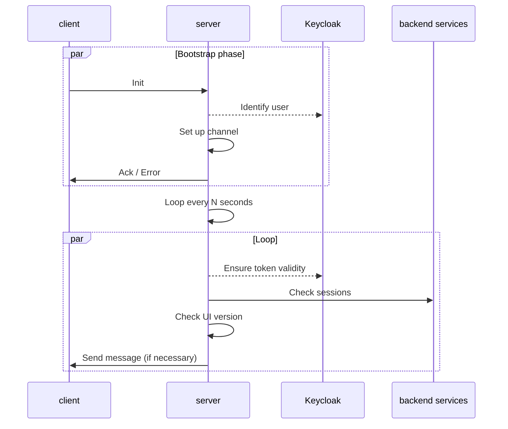
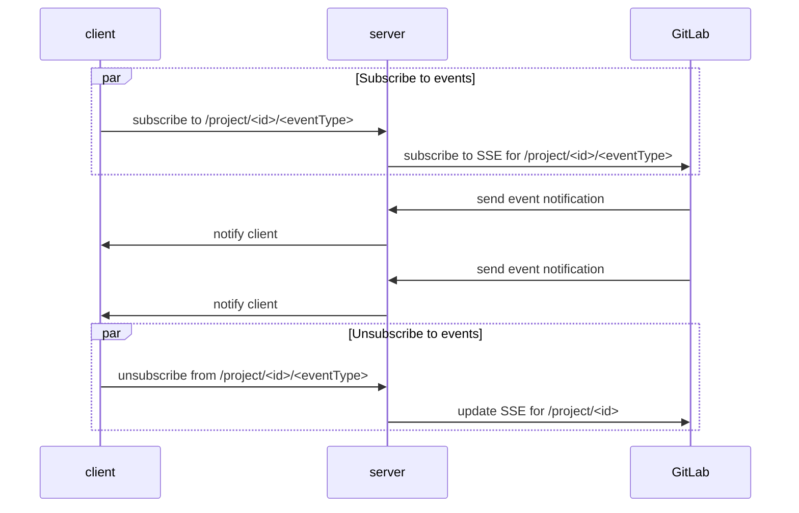

# WebSocket

Having WebSockets adds the possibility to push notifications from the UI server to the UI client.

The first goal is to remove the inefficient polling system we currently use to keep an up-to-date
status of some resources. Initially, this might be limited to moving the polling logic from the
client to the server with little changes. Ideally, we will later rely more on server events
generated by the backend services, removing polling entirely.

The second goal is to have a channel for generic or specific notifications. We already have a
raw system for notifications in the client. Although that might require an update, we will then
be able to use it more extensively and ensure the content shown on the page won't become stale
without notifying the user.

## Why WebSocket?

There aren't many well-established technologies to create a channel from the server to
the client. The final choice between [WebSocket](https://en.wikipedia.org/wiki/WebSocket) and
[Server-sent events](https://en.wikipedia.org/wiki/Server-sent_events) has seen the first
prevail since it enables the client to send messages to the server too.
Those can be used as commands to subscribe and unsubscribe to specific events based on the
resources the user wants to access

## Authentication

The authentication can only be done while the connection is established. This is not a big
deal for the UI server, considering it manages the user's tokens on behalf of the user.
At each cycle/request, we can verify whether the tokens are still valid or not, and either
proceed or send an error message and close the channel when necessary.

# Overview

This is (broadly) the current set of interactions between the client and the server.

Eventually, the client should be able to send messages interpreted as instructions by the server.
This should allow the client to subscribe and unsubscribe to events.

## Handle multiple tabs/sessions

Since each loop sends requests to back-end services on behalf of the user, we want to limit them
to the minimum. This requires a strategy to handle multiple tabs in a single loop.
WebSocket channels are handled per user, and each time a new channel is added, the
server sends the same notification to each of them. When the last user's channel is removed,
the loop stops.
