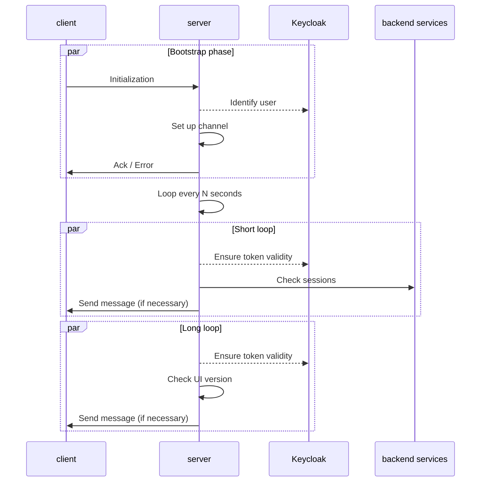
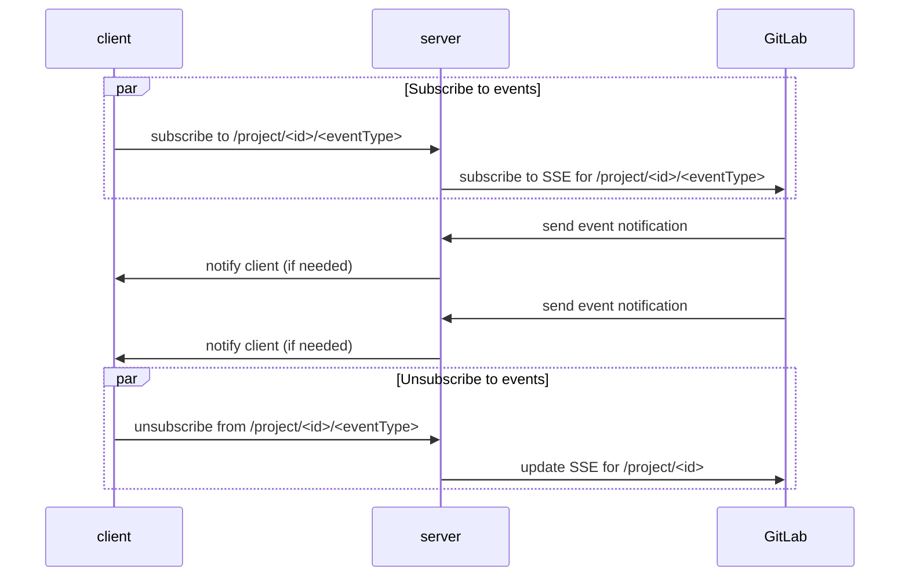

# WebSocket

WebSocket allows the UI server to push notifications directly to the UI client through a
bi-directional communication channel after an initial setup that helps in identifying the
user.

This way, we can remove inefficient polling systems to keep an up-to-date status of some
resources. In the first iteration, this will be limited to moving the polling logic from the
client to the server with little changes. Ideally, we will later rely more on server events
generated by the backend services, removing polling entirely.

WebSocket also simplifies notifications. We already have a raw system for that in the client,
and after updating it, we could use it more extensively and ensure the content shown on all
pages won't become stale without notifying the user.

## Why WebSocket?

There aren't many well-established technologies to create a channel allowing the server to
send data to the client. The final choice between
[WebSocket](https://en.wikipedia.org/wiki/WebSocket) and
[Server-sent events](https://en.wikipedia.org/wiki/Server-sent_events) has seen the first
prevail since it also enables the client to send messages to the server.
Those can be used as commands to subscribe and unsubscribe to specific events based on the
resources the user wants to access.

## Authentication

The authentication can only be done while establishing the connection. This is not a big
deal for the UI server, considering it manages the access tokens on behalf of the users.
At each cycle/request, we can verify whether the tokens are still valid or not, and either
proceed or send an error message and close the channel.

# Overview

This is the current set of interactions between the client and the server.

Eventually, the client should be able to send messages interpreted as instructions by the server.
This should allow the client to subscribe and unsubscribe to specific events.

The following is just an example:

## Handle multiple tabs/sessions

Since each loop sends requests to back-end services on behalf of the user, we want to limit them
to the minimum. This requires a strategy to handle multiple tabs in a single loop.
WebSocket channels are handled per user, and each time a new channel is added, the
server sends the same notification to each of them. When the last user's channel is removed,
the loop stops.
